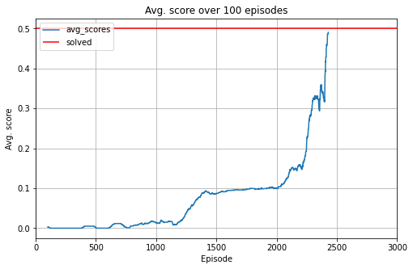

# Report

This report describes my implementation to solve the tennis project.  

## Learning Algorithm

The implementation here is a Multi-Agent Deep Deterministic Policy Gradient Algorithm. This implementation is chosen as the previous project was sloved by DDPG, therefore, continueing from there the MADDPG is used. The advantages of using this algorithm is that `all agents can share the same replay buffer` and `the critic is able to learn from the totality of the states and actions taken by each actor`. 

## Tennis

DDPG is a type of actor-critic methods which are applicable to continuous state space action. For more information about DDPG please read this [article](https://arxiv.org/pdf/1509.02971.pdf). DDPG trains simultaneously two networks: An actor (selects the optimal (deterministic) policy based on the current state) and a critic (approximates the value function of the state-action pair).

### Actor

The actor neural network consist of two hidden layer with ReLu function as activation function. The input layer has 24 neurons. The first hidden layer has 550 neurons and the second hidden layer has 300 neurons. The output layer has 2 neurons.

A tanh function is applied at the output layer so that the result can be in between [-1, 1].

The actor also add noise to its action as a Ornstein-Ulenbeck process with mu(0), theta(1) and sigma(0.15). Note that noise decays with a factor of 0.95 after each episode.  

### Critic

The critic neural network consist of two hidden layer with ReLu function as activation function. the input layer is 52 neurons (equals to twice the state space as there are two agents). The first hidden has 550 neurons. The second hidden layer has 300 neurons whereas the output layer only has 1 neuron.

### Hyper-Parameters

- Replay Buffer Size: 1000000
- Batch Size: 300
- Gamma (discount factor): 0.99
- Tau (soft update): 0.001
- Learning Rate (Actor): 0.0001
- Learning Rate (Critic): 0.0005
- Weight Decay: 0

Traning Results:
```bash
Avg. score episodes 0-100: 0.0030000000447034836
Avg. score episodes 100-200: 0.0
Avg. score episodes 200-300: 0.0
Avg. score episodes 300-400: 0.004000000059604645
Avg. score episodes 400-500: 0.0010000000149011613
Avg. score episodes 500-600: 0.0
Avg. score episodes 600-700: 0.01160000018775463
Avg. score episodes 700-800: 0.005400000102818012
Avg. score episodes 800-900: 0.010400000177323818
Avg. score episodes 900-1000: 0.013800000213086605
Avg. score episodes 1000-1100: 0.016900000255554916
Avg. score episodes 1100-1200: 0.019000000339001417
Avg. score episodes 1200-1300: 0.05570000087842345
Avg. score episodes 1300-1400: 0.08970000138506293
Avg. score episodes 1400-1500: 0.0874000014550984
Avg. score episodes 1500-1600: 0.09460000153630972
Avg. score episodes 1600-1700: 0.09550000155344605
Avg. score episodes 1700-1800: 0.09940000161528588
Avg. score episodes 1800-1900: 0.09910000154748559
Avg. score episodes 1900-2000: 0.09910000151023268
Avg. score episodes 2000-2100: 0.1382000020891428
Avg. score episodes 2100-2200: 0.1508000022917986
Avg. score episodes 2200-2300: 0.31980000477284193
Avg. score episodes 2300-2400: 0.38430000575259327
Solved in 2428 steps!
```



The number of episodes needed to solve the environment is 407 episodes.  

### The Weights

The weights are saved in my_weights.pth.

